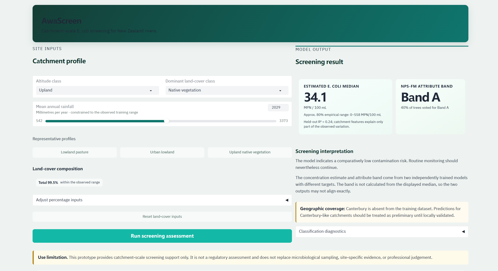

# AwaScreen

**Catchment-scale E. coli screening for New Zealand rivers**

AwaScreen is a machine-learning prototype that estimates river E. coli conditions
from catchment characteristics. It combines two independently trained models:

- a regression model that estimates median E. coli concentration in MPN/100 mL;
- a classification model that predicts the NPS-FM 2020 E. coli attribute band
  from A to E.

The repository includes the modelling notebooks, trained model artefacts, a
tested prediction service, and a Gradio interface for interactive screening.
The application is intended for exploratory prioritisation—not regulatory
assessment or replacement of field sampling.

## Live demo

[**Launch AwaScreen on Hugging Face Spaces →**](https://huggingface.co/spaces/Andy10244/AwaScreen)

[](https://huggingface.co/spaces/Andy10244/AwaScreen)

The Space may take a short time to wake after a period of inactivity.

## Interactive application

The Gradio interface allows a user to:

- enter rainfall, altitude class, dominant land cover, and upstream land-cover
  composition;
- load representative lowland, urban, and upland catchment profiles;
- generate a concentration estimate and NPS-FM attribute-band prediction;
- view an approximate empirical uncertainty range for the regression output;
- inspect random-forest vote shares across Bands A–E;
- receive warnings for inputs associated with lower model reliability; and
- check whether the land-cover percentages form a plausible total.

Predictions are generated locally from the saved scikit-learn models. No
external language model or API is required for the current version.

## Model summary

| Task | Selected model | Held-out performance | Application output |
| --- | --- | --- | --- |
| Regression | Transformed-target MLP regressor | R² = 0.24; RMSE = 366.31; MAE = 179.59 | Estimated median E. coli concentration and an approximate empirical 80% range |
| Classification | Balanced random forest | Accuracy = 0.63; macro-F1 = 0.53 | NPS-FM attribute band and tree vote distribution |

The evaluation used a stratified 80/20 split with `random_state=42`: 271
training sites and 68 held-out sites from 339 labelled observations.

The displayed regression interval is derived from the 10th and 90th
percentiles of held-out residuals. It is descriptive and has not been calibrated
as a formal prediction interval. Random-forest vote shares are also not
calibrated probabilities.

## Important limitations

- Catchment features explain only part of the variation in observed E. coli
  concentrations, as reflected by the held-out regression R² of 0.24.
- Subgroup evaluation indicated lower reliability for lowland Pasture and Urban
  sites. The interface flags these profiles automatically.
- Canterbury is absent from the training dataset. Predictions for
  Canterbury-like catchments require local validation.
- The regression and classification models were trained independently against
  different targets. The predicted concentration and attribute band may
  therefore not align exactly.
- Outputs should be treated as screening and prioritisation signals only. They
  do not replace microbiological sampling, site-specific evidence, or
  professional judgement.

## Quick start

Python 3.12 is recommended because it matches the environment used to validate
the saved model artefacts.

### 1. Clone the repository

```bash
git clone https://github.com/Ming-Liu-1170030/AwaScreen.git
cd AwaScreen
```

### 2. Create and activate an environment

Using Conda:

```bash
conda create -n riverwq python=3.12
conda activate riverwq
```

Alternatively, using `venv` on Windows:

```powershell
py -3.12 -m venv .venv
.venv\Scripts\Activate.ps1
```

On macOS or Linux:

```bash
python3.12 -m venv .venv
source .venv/bin/activate
```

### 3. Install dependencies

```bash
python -m pip install -r requirements.txt
```

The models were serialised with scikit-learn 1.8.0. Using the pinned dependency
versions avoids incompatible model-loading behaviour.

### 4. Run the application

```bash
python app.py
```

Open the local URL printed by Gradio, normally `http://127.0.0.1:7860`.

## Tests

Run the prediction-service tests from the repository root:

```bash
python -m unittest discover -s tests -v
```

To check that both saved models load correctly and produce a sample prediction:

```bash
python scripts/check_models.py
```

## Repository structure

```text
AwaScreen/
├── app.py                 # Gradio application and interface callbacks
├── assets/
│   └── style.css          # Responsive application styling
├── data/
│   ├── riverWQ_dataset.csv
│   └── riverWQ_data_dictionary.csv
├── figures/               # Analysis and model-evaluation figures
├── models/
│   ├── 1_rg_mdl_regression_mlp.pkl
│   └── 2_cf_mdl_classification_random_forest.pkl
├── scripts/
│   └── check_models.py    # Model-loading smoke test
├── services/
│   └── prediction.py      # Validation, inference, intervals, and diagnostics
├── src/
│   ├── 01_eda.ipynb
│   └── 02_modelling.ipynb
├── tests/
│   └── test_prediction.py
└── requirements.txt
```

## Data and features

The bundled dataset contains New Zealand river monitoring-site information,
catchment descriptors, land-cover proportions, water-quality measurements, and
NPS-FM 2020 attribute-band labels. The deployed models use 14 predictors:

- 11 upstream land-cover percentage variables;
- mean annual rainfall;
- lowland or upland altitude class; and
- dominant River Environment Classification land-cover type.

The modelling workflow and exploratory analysis are documented in
`src/01_eda.ipynb` and `src/02_modelling.ipynb`. Variable definitions are
provided in `data/riverWQ_data_dictionary.csv`.

## Responsible interpretation

AwaScreen is a portfolio and decision-support prototype. A prediction describes
patterns learned from the available training data; it is not a direct
measurement of current water quality and does not establish causality. Any
operational use should include local monitoring data, domain review, and an
explicit validation process.

## Roadmap

- add automated deployment smoke tests and lightweight uptime monitoring;
- validate local feature-attribution methods before exposing per-prediction
  explanations;
- evaluate performance with locally representative Canterbury data; and
- reassess uncertainty and probability calibration as more labelled sites
  become available.
